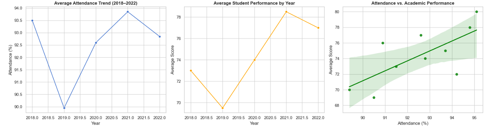

# 🧠 Python Student Achievement Analysis  

Welcome! This project analyzes patterns in student achievement using Python.  
It explores relationships between attendance, assessment scores, and academic performance metrics across multiple schools.  

---

## 🧰 Tools & Libraries
- **Python:** pandas, matplotlib, seaborn  
- **Data:** Student achievement dataset (2018–2021)  
- **Focus:** Predictive analytics, attendance impact, performance visualization  

---

## 📊 Preview

---

## 📂 Files
📄 [Download Report (PDF)](link-to-your-.pdf-file)  
📁 [Download Dataset (CSV)](link-to-your-.csv-file)  

---

## 💡 Insights
This analysis demonstrates:
- How attendance correlates with student performance  
- The value of Python for automating education analytics  
- Predictive modeling using pandas and visualization libraries  

---

## ✉️ Contact
Created by **Neka Everett**  
📧 [Email](mailto:neka.everett@gmail.com)  
🔗 [Portfolio Home](https://nekaeve24.github.io/data-portfolio)
